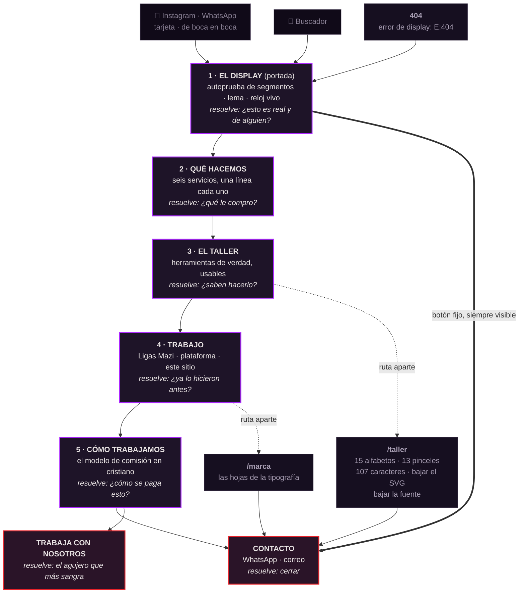

# El Sitio · plan de construcción

**Fecha:** 30 de julio de 2026
**Cómo salió:** Carlos convocó al **consejo entero** (`multi-agent` + `four-judges`) y además pidió
mi criterio aparte. El acta completa —quién dijo qué y qué se descartó— está en
[`.claude/veredictos/2026-07-30-el-sitio.md`](../.claude/veredictos/2026-07-30-el-sitio.md).
Este archivo es sólo **lo decidido**, para construir.

**Reemplaza y afina** la lista de secciones de `CLAUDE.md` §7, que se escribió antes de que
existieran el logo vectorizado, la fábrica de tipografías y la fuente de la casa.

---

## 0 · La tesis, en una línea

> **El sitio no es un folleto que enseña herramientas. El sitio ES una herramienta.**

`CLAUDE.md` §7 decía *"el sitio es la demo"*. Es correcto pero se queda corto, porque una demo se
mira y una herramienta **se usa**. Y usar es lo que retiene, lo que convence a un comprador técnico
y —esto es lo que lo vuelve nuestro y no de nadie más— lo que dice el lema de la empresa:
*si no existe la herramienta, se construye la herramienta.*

Un sitio de portafolio con animaciones bonitas lo tiene cualquiera. **Un sitio donde el visitante
mueve una perilla y la tipografía de la casa se redibuja en vivo, no.**

---

## 1 · Qué incluye

Cinco secciones en la página principal, y las piezas pesadas en **rutas aparte** que sólo cargan
si alguien las pide. Eso no es purismo: es que nadie que sólo quiere el teléfono debe descargar un
juego de megabytes.

### La página principal

| # | Sección | Qué hace | Qué resuelve |
|---|---|---|---|
| 1 | **El display** (portada) | Paloma + logotipo armándose segmento por segmento, el lema, una frase, **los seis servicios en una línea gris**, y el botón de WhatsApp. Un reloj con la hora **real** en la tipografía de la casa | Que en dos segundos se vea vivo y hecho por alguien — **y que se entienda el negocio en una captura reenviada** |
| 2 | **Qué hacemos** | Los seis servicios **en tres grupos** —la base · los procesos · la imagen—. **Nombre del servicio grande, frase chica debajo** (ver la corrección al pie). Sin nombres de tecnología | Que se entienda qué se compra, y que es un sistema |
| 3 | **El taller** | La fábrica de tipografías **corriendo en la página**. El visitante cambia esqueleto, pincel y ochavo y las letras se redibujan | La prueba de capacidad. Es la sección que nadie más puede copiar |
| 4 | **Trabajo** | Ligas Mazi por su nombre · la plataforma de gestión sin marca ajena. **Torre Infinita queda fuera** (ver §7-ter) | La prueba comercial |
| 5 | **Cómo trabajamos · Contacto** | Que entramos a la operación y nos quedamos, WhatsApp, correo, y **"trabaja con nosotros"** para colaboradores — **la comisión se dice ahí, no en el texto del cliente** (decisión de Carlos) | Cerrar. Y captar gente, que es el agujero que más sangra |

> ⚠️ **Corrección de julio 30, del consejo de los textos.** Esta tabla decía **"una línea cada
> uno"** para los seis servicios. Las seis frases que escribió Carlos miden **110–140 caracteres**:
> a 390 px son dos o tres líneas cada una, y seis seguidas vuelven la sección una pared de párrafos
> casi iguales —el 47% de todo el texto del sitio está en esta sección—. **Se corrige el plan, no las
> frases:** el nombre del servicio va grande y la frase va chica debajo, para que la sección se lea de
> un barrido por los seis nombres y sólo el interesado lea la frase. Es solución tipográfica, no de
> texto. Acta: [`.claude/veredictos/2026-07-30-los-textos.md`](../.claude/veredictos/2026-07-30-los-textos.md).

**La sección 5 trae algo que §7 no tenía: la entrada para colaboradores.** La puso Sofía y tiene
razón — el modelo de comisión necesita gente, y hoy no hay una sola manera de que alguien nos
busque para trabajar.

### Las rutas aparte

| Ruta | Qué es | Por qué no va en la principal |
|---|---|---|
| `/taller` | La fábrica completa: 15 alfabetos, 13 pinceles, 6 remates, el juego de 107 caracteres, descarga del SVG | Pesa y es para quien se clavó |
| ~~`/juega`~~ | ❌ **Eliminada.** Decisión de Carlos, ver §7-ter | |
| `/marca` | Las hojas que ya existen (`marca/mazi.html`, `tipos.html`) limpiadas | Es material de venta, no de portada |

**Candidata, sin prometer:** `/vectorizar` — subir un PNG y bajar un SVG, gratis, en el navegador.
Sería el mejor imán que podríamos tener, porque es útil de verdad y deja a la vista lo que sabemos
hacer. **Hay que confirmar antes** que `imagetracerjs` corre en el navegador sin la parte de Node;
si no corre, no se anuncia.

---

## 2 · El acomodo · dónde va qué

Teléfono en vertical primero. Siempre.

```
┌─────────────────────────────┐
│ ▌paloma   GRUPO MAZI    ⌾ │ ← barra fija, delgada. El ⌾ es WhatsApp
├─────────────────────────────┤
│                             │
│      ▓▓▓▓  ▓▓▓▓  (paloma)   │
│      GRUPO MAZI             │ ← se arma segmento por segmento
│                             │
│   Todo gran proyecto        │
│   comienza con una base     │
│   sólida. Nosotros la       │
│   construimos, y también    │
│   la última pieza que le    │
│   da vida.                  │
│   web · software · mkt ·    │ ← los seis, en gris chico
│   video · gestión · tiempos │
│                             │
│   ┌───────────────────┐     │
│   │  Hablar por WhatsApp    │ ← el único botón de la primera pantalla
│   └───────────────────┘     │
│                             │
│              10:23  ← hora real, en nuestra tipografía
├─────────────────────────────┤
│  QUÉ HACEMOS                │
│  ── LA BASE ──              │
│  Páginas web · una línea    │
│  Software · una línea       │
│  ── LOS PROCESOS ──         │
│  Gestión · Tiempos y mov.   │
│  ── LA IMAGEN ──            │
│  Marketing · Video y foto   │
├─────────────────────────────┤
│  EL TALLER                  │
│  [ cronómetro │ tu nombre ] │ ← fichas: elegir herramienta
│                             │
│        00:04.82             │ ← LA LECTURA, arriba
│    ciclo 7 · prom 5.1 s     │
│                             │
│  perilla ────●────          │ ← los controles, abajo
│  ⤓ exportar ↺ ⌾ compartir   │ ← LA BANDEJA, igual en todas
│  "nada de esto sale de tu   │
│   teléfono"                 │
├─────────────────────────────┤
│  TRABAJO                    │
│  Ligas Mazi                 │
│  Plataforma de gestión      │
│  Este sitio                 │
├─────────────────────────────┤
│  CÓMO TRABAJAMOS            │
│  … comisión en cristiano    │
│  ⌾ WhatsApp   ✉ correo      │
│  ¿Quieres trabajar con      │
│  nosotros? →                │
└─────────────────────────────┘
```

**Las reglas de acomodo, que no se negocian:**

1. **El botón de WhatsApp se ve sin hacer scroll.** Y vuelve a aparecer al final de cada sección
   larga y al final de cada ruta aparte. Iván: *"un visitante que se clavó en el taller y se fue
   sin escribir es una pérdida, no un éxito."*
2. **La primera pantalla tiene que sobrevivir a ser una captura.** La gente va a llegar de
   Instagram y de WhatsApp, y va a reenviar un screenshot. Ese screenshot tiene que decir quién
   somos, qué hacemos y cómo contactarnos, sin scroll.
3. **Una sola cosa por pantalla.** Nada de dos columnas en teléfono.
4. **Objetivos táctiles de 44 px mínimo.** Ya nos mordió en Ligas Mazi (`CLAUDE.md` §11).

---

## 3 · La animación de apertura

**La autoprueba del display.** Un reloj de LED, al encender, prende **todos** los segmentos un
instante y luego muestra la hora. Eso es un gesto real de la máquina, no un efecto inventado — y
resulta que nuestra tipografía *es* un display de segmentos.

Cómo va:

```
0.00 s  negro
0.15 s  TODOS los segmentos del logotipo prendidos, en violeta tenue   ← la autoprueba
0.45 s  se apagan los que no van; queda GRUPO MAZI
0.70 s  entra la paloma (escala corta, sin rebote)
0.95 s  entra la frase
1.20 s  entra el botón
1.20 s  el reloj arranca a contar la hora real
```

**Por qué ésta y no otra:**

- **Es nuestra.** Sale de la tipografía que construimos hoy, que sale de la foto que mandó Carlos.
  No hay manera de que se vea prestada.
- **Dura 1.2 s.** Una apertura que tarda tres segundos es un peaje, no un regalo.
- **No bloquea nada.** El contenido está en el HTML desde el primer byte; la animación sólo revela.
  Si el JavaScript truena, la portada se ve completa.
- **`prefers-reduced-motion` es trivial:** se salta a 1.20 s. Sin ramas raras.
- **Pesa casi nada:** la fuente (9 KB) + CSS. Cero librerías.
- **Y se repite gratis:** el mismo gesto sirve para revelar cada sección al entrar en pantalla, con
  un cuarto de la intensidad. Un solo idioma de movimiento en todo el sitio.

**Lo que NO va:** pantalla de carga con porcentaje, logo girando, cortina que tapa el contenido,
scroll secuestrado en la portada, ni video de fondo.

---

## 3-bis · EL TALLER · el instrumento con módulos

**De dónde sale:** Carlos, 30 de julio — *"en herramientas no tendremos sólo el de fuentes;
necesitamos cosas a diferentes escalas para las industrias reales, necesitamos que todo sea una sola
experiencia, así que vamos a priorizar diseño."*

Pasó por la casa de ingeniería
([acta](../.claude/auditorias/2026-07-30-plan-del-sitio.md), **ARREGLAR PRIMERO**) y por el consejo de
negocio y los cuatro jueces
([veredicto](../.claude/veredictos/2026-07-30-el-taller-de-herramientas.md), **CONSTRUIR con alcance
congelado en dos**).

### Qué significa "una sola experiencia" — y es lo contrario de lo obvio

> **No se diseñan cinco herramientas. Se diseña UN instrumento con cinco módulos.**

Cinco juguetes con estilos parecidos **no** son una experiencia única: se nota a los dos segundos
porque los controles no se comportan igual. **La consistencia visual sin consistencia de interfaz
dura hasta la tercera herramienta.**

**El vocabulario del instrumento — cinco piezas y ni una más:**

| Pieza | Qué es | Regla |
|---|---|---|
| **La perilla** | Rango con etiqueta y cifra en Mazi | **Mínimo 44 px de alto.** Es la que más se toca |
| **El selector** | Elegir entre opciones | Fichas, no menú. En teléfono un menú es un paso de más |
| **La lectura** | Donde sale el resultado | **Siempre arriba** de los controles en teléfono |
| **El botón de acción** | Uno por herramienta, en violeta | **Uno.** El segundo va en texto |
| **La bandeja** | Exportar · reiniciar · compartir | **Idéntica en todas.** Es la que hace que se sienta la misma máquina |

**Y el contrato en código, que ES la experiencia única dicha técnicamente:**

```js
sitio/taller/<herramienta>.js  →  export default {
    id, nombre, servicio,      // a qué servicio de los seis pertenece
    montar(nodo, taller),      // se dibuja dentro del nodo que le dan
    exportar(),                // { nombre, tipo, datos }  ← el MISMO para todas
    liberar()                  // se apaga al salir: temporizadores, listeners
}
```

Si `exportar()` no es igual para todas, el botón de exportar tiene que ser distinto en cada una — y
ahí se acabó la experiencia única por más que se pinten iguales. Y `liberar()` no es adorno: el
cronómetro tiene un temporizador vivo; sin apagarlo al cambiar de herramienta, sigue corriendo.

> **Cuándo se escribe el contrato:** antes de la **segunda** herramienta, no de la primera. Escribir
> la arquitectura de cinco herramientas teniendo cero es cómo no se entrega nada. *(Nadia corrigiendo
> a Verónica.)*

### Las herramientas — cada una prueba un servicio, o no va

| Herramienta | Prueba el servicio | Para quién es, de verdad | Cubeta |
|---|---|---|---|
| **1ª · Cronómetro de tiempos y movimientos** | *Tiempos y movimientos* | Un taller, una cocina, una línea. Mide ciclos, saca promedio y desviación, **señala el cuello de botella** y exporta a Excel | 🟢 |
| **2ª · Tu nombre en Mazi** | *Marketing · identidad* | Cualquiera. Es el imán: se comparte solo | 🟢 |
| *después* · La fábrica completa | *Marketing · identidad* | El que se clavó. Es la que nadie puede copiar | 🟡 |
| *después* · Redimensionador para redes | *Video y fotografía* | Una tienda, un restaurante: una foto → los cinco formatos | 🟡 |
| *después* · Vectorizador | *Video y foto · web* | El negocio que sólo tiene su logo en JPG borroso | 🔴 |
| *Fase 3* · Cotizador | *Gestión de negocios* | — | — |

**Alcance congelado en DOS para la v1.** Las demás entran de una en una, y **sólo cuando haya alguien
usando la anterior**. Cinco herramientas es una apuesta de un mes sobre una hipótesis sin probar.

**Y falta uno, hay que decirlo:** *Desarrollo de software* y *Páginas web* **no tienen herramienta
pública**, y son los dos servicios más caros. **El sitio mismo es su demostración** — por eso Trabajo
ahora incluye este sitio como pieza.

### Por qué el cronómetro va primero, y no la de tipografías

1. Es 🟢 y la de tipografías es 🟡 (dependía de un arreglo que ya se hizo, pero aun así).
2. **Es literalmente uno de los seis servicios.** *Tiempos y movimientos* es el que nadie entiende;
   una herramienta que lo hace lo explica sin explicarlo.
3. **Quien lo abre ya está calificado.** Nadie mide los ciclos de su cocina por diversión: lo hace
   porque siente que se le va el tiempo y no sabe dónde. Ésa es la persona que nos compra.
4. **Es la mitad de una herramienta que la empresa necesita de todos modos** — la bitácora de horas
   de `CLAUDE.md` §6. No es una desviación: es la Fase 0 avanzando disfrazada de marketing.

### Lo que va en pantalla, y sale del consejo

| Qué | Dónde | De quién |
|---|---|---|
| **"Regalamos la medición. Cobramos la interpretación y el arreglo."** | En el taller, junto a las herramientas | Renata. Sin esto, la herramienta compite con nosotros mismos |
| **"Nada de esto sale de tu teléfono."** | En cada herramienta que guarde algo | Paola. Es **LA REGLA §2 dicha para el cliente**, y es la primera vez que la podemos demostrar en vez de prometerla |
| **La salida a WhatsApp, al TERMINAR la medición** | No antes | Iván. En el momento en que acaba de ver su propio cuello de botella |
| **Nuestro nombre y el WhatsApp en el archivo exportado** | En el Excel y en el SVG | Iván. Ese archivo se manda a un socio o a un jefe: **es publicidad que viaja sola** |

### Las reglas del instrumento

1. **Las herramientas no se animan al entrar. Responden al tacto y ya.** El movimiento guiado por
   scroll es para el relato; dentro de un instrumento, el único movimiento es el que provoca el dedo.
   *(Iker: mezclarlos es lo que hace que un sitio se sienta caro por fuera y barato al usarlo.)*
2. **Mazi para cifras GRANDES, nunca para números chicos.** A 40 px la cifra es el mejor argumento de
   marca del sitio; a 12 px es un acertijo — ya pasó en la central, donde el `5` se leía como `S`.
3. **El fósforo `#E8232A` se amplía a la lectura de las herramientas** (que también son pantallas),
   y **sigue prohibido en botones y títulos**. Ampliar la frontera por escrito es mejor que verla
   romperse sola.
4. **Anchos:** teléfono una columna (lectura arriba) · **≥900 px dos columnas** (controles izquierda,
   lectura derecha) · ≥1400 px crece la lectura, **no** los controles.
5. **`import()` dinámico por herramienta.** La portada no carga un byte del taller. Es lo que hace
   que la herramienta seis no le cueste velocidad a nadie.
6. **Si una herramienta truena, lo dice** — *"esta herramienta no cargó, escríbenos y te la
   enseñamos"* con el botón. Un espacio en blanco es peor que un error honesto, sobre todo en la
   sección que prueba que sabemos.

### Lo que Michi ya rompió, y hay que contemplar desde el primer día

Nueve hallazgos, **seis del cronómetro**: doble toque en "marcar ciclo" (ignorar bajo ~300 ms) ·
teléfono bloqueado a media medición (**el tiempo se calcula con la hora del reloj, no contando
cuadros**) · cambio de pestaña · recarga con 40 ciclos medidos (**guardar en cada ciclo, no al
final**) · cambiar de herramienta con el cronómetro corriendo (`liberar()`) · exportar sin haber
medido (**botón apagado hasta que haya algo**). Más: imagen de 80 MB, nombre de 4,000 letras, y girar
el teléfono con la lectura abierta.

---

> 📎 **Referencias de efectos, con los números medidos:**
> [`REFERENCIAS.md`](REFERENCIAS.md). Resumen: **una sola demo de las que trajo Carlos pesa 1,421 KB
> de JavaScript** —siete veces el presupuesto de toda la portada— y **seis de las ocho necesitan
> mouse**, que en un teléfono no existe. Se toman las ideas; el stack no. La única que entra es la
> máscara que revela, atada al scroll, y cuesta 30 líneas de CSS.

## 4 · El estilo

**Un instrumento, no un cartel.** La referencia no es una agencia: es un tablero — un reloj de
estación, una consola, un medidor. Eso ya está en la tipografía, así que el resto del sitio nada
más tiene que no contradecirla.

| Decisión | Qué es | Por qué |
|---|---|---|
| **Oscuro por defecto** | Fondo casi negro con tinte violeta | Un display se lee sobre negro. Y es lo que ya dice `CLAUDE.md` §7 |
| **Tipografía de la casa en todo lo grande** | Mazi en titulares, cifras, navegación y etiquetas | Es el argumento de venta más barato que tenemos: la marca *es* la tipografía |
| **Una sans del sistema en el texto corrido** | `system-ui` para párrafos | Mazi es de rótulo. Un párrafo largo en tipografía de display se lee mal, y decir esto es más honesto que forzarla |
| **Líneas de 1 px** | Separadores finos, sin sombras ni degradados | Cuesta cero y se ve caro |
| **Rejilla visible pero discreta** | Todo alineado a una columna clara, con márgenes generosos | Un instrumento está medido |
| **Números grandes** | La hora, los años, las cifras | Nuestra tipografía es mejor en dígitos que en prosa. Se juega donde somos fuertes |
| **Cero adorno** | Ni partículas, ni glass, ni gradientes de moda, ni blobs | Todo eso envejece en un año y grita plantilla |

**Texto corto por diseño, no por flojera.** `CLAUDE.md` §11 dice con todas sus letras que el hueco
de capacidad más grande de la casa es **voz de marca y copywriting**. Un sitio bonito con textos
flojos se lee barato. Entonces: **una línea por sección**. Corto es donde somos fuertes; largo es
donde somos débiles. Esto es una decisión de diseño tomada desde un diagnóstico honesto, no un
atajo.

---

## 5 · La paleta

Se confirma la de `CLAUDE.md` §7 y se le agrega **una sola cosa**: el rojo de fósforo, y sólo
dentro del display.

| Papel | Color | Dónde |
|---|---|---|
| **Vacío** | `#100A18` | El fondo de todo |
| **Superficie** | `#1E1428` | Tarjetas, recuadros, la barra |
| **Línea** | `#2A2036` | Separadores, bordes |
| **Hueso** | `#E9E4E4` | Todo el texto |
| **Apagado** | `#8B8296` | Texto secundario, etiquetas |
| **Violeta** | `#AC27FF` | **El acento de la marca.** Un solo uso a la vez |
| **Fósforo** | `#E8232A` | **Sólo dentro del display**: el reloj, los segmentos encendidos |

**El fósforo no es un segundo color de marca — es un material.** Aparece únicamente donde el sitio
está imitando una pantalla de LED, igual que en la foto que mandó Carlos. Si se sale de ahí y
empieza a aparecer en botones o títulos, la marca deja de tener un acento y pasa a tener dos, que
es lo mismo que no tener ninguno. **Esa frontera hay que respetarla.**

Todo en variables CSS desde el primer archivo, porque Carlos va a querer cambiar algo y tiene que
ser una línea.

---

## 6 · Qué NO va en la página

Esto es la mitad del trabajo.

**Mentiras y medias verdades**
- ⛔ **ICAMP.** Ni el nombre, ni el logo, ni el video con su marca. No son clientes (`CLAUDE.md` §7).
- ⛔ **"Clientes" que no son clientes.** Ninguna fila de logos, ninguna insignia de "confían en".
- ⛔ **Testimonios.** No existen. Inventarlos es lo que más rápido quema a una empresa nueva.
- ⛔ **"Nuestro equipo"** con caras. El equipo es Carlos y sus herramientas. Decir otra cosa es
  mentir, y además se cae en la primera llamada.
- ⛔ **Cifras sin respaldo:** "+50 proyectos", "98% de satisfacción". Nada de eso es cierto.

**Cosas que se ven mal o envejecen**
- ⛔ Fotos de stock de gente sonriendo con laptops (ya estaba en §7).
- ⛔ Carrusel automático. Nadie espera al segundo cuadro.
- ⛔ Video de fondo con audio. Ni sin audio, en teléfono.
- ⛔ Scroll secuestrado, desplazamiento horizontal, parallax de tres capas.
- ⛔ Cursor personalizado. En teléfono no existe y en escritorio estorba.
- ⛔ Modo claro a medias. O se hace bien o se queda oscuro. **Por ahora: sólo oscuro.**

**Cosas que nos abren el flanco**
- ⛔ **Precios.** Se cotiza, no se lista (§7 · proteger la propiedad).
- ⛔ **La lista de tecnologías.** Nadie compra "React + Supabase" y decirlo nos vuelve intercambiables.
- ⛔ **Ligas al repositorio.** El sitio es justo lo que va a traer ese tráfico (§7).
- ⛔ **Un blog.** Nadie lo va a escribir. Una sección vacía con fecha de hace ocho meses hace más
  daño que no tenerla.
- ⛔ **Formulario de contacto largo.** Nombre y mensaje, o de plano nada más el botón de WhatsApp.
  Y ojo: **GitHub Pages no tiene servidor**, así que un formulario de verdad necesita un externo.
  Eso va a `PENDIENTES.md`, no al sitio de una.

---

## 6-bis · El menú de contexto propio · decisión de Carlos

Carlos pidió quitar el menú de contexto del navegador *"porque es más aesthetic y no se salen de la
experiencia"*. **Se hace, y se hace bien** — hay una versión de esto que sí suma:

**No se bloquea nada: se REEMPLAZA.** El clic derecho abre **nuestro** menú, en la tipografía y los
colores de la casa, con cosas que sirven:

```
┌──────────────────────────┐
│  Copiar liga             │
│  Compartir por WhatsApp  │
│  ─────────────────────   │
│  Ver la marca            │
│  Hablar con nosotros     │
└──────────────────────────┘
```

Eso es lo que lo vuelve estética y no fricción: el visitante no pierde una función, gana un atajo —
y el más útil de todos es "compartir por WhatsApp", que es justo por donde va a llegar la gente.

**Lo que NO se toca, y esto no es negociable porque rompe el sitio:**
- La **selección de texto** se queda. Bloquearla impide copiar el teléfono y el correo.
- Los **atajos de teclado** se quedan. `Ctrl+C`, `Ctrl+F`, `Tab`.
- El **lector de pantalla** se queda funcionando.
- En **teléfono no aplica**: no hay clic derecho. Ahí la pulsación larga sigue siendo la del sistema.

**Y lo digo una vez y no vuelvo a insistir:** esto es estética, no protección. Quien quiera el código
lo tiene con `Ctrl+U`. Lo que protege de verdad ya está dicho en `CLAUDE.md` §7: la ventaja no está
en el código, está en la velocidad y el criterio.

---

## 6-ter · Animación por scroll — corrección al plan

**Yo escribí "nada de scroll secuestrado" y Carlos pidió animaciones que sigan el scroll. No se
contradicen, y mi redacción fue floja. Son dos cosas distintas:**

| | Qué es | Veredicto |
|---|---|---|
| **Scroll secuestrado** | La página se apodera del scroll: te obliga a pasar por una secuencia a su ritmo, un gesto salta una pantalla completa, no puedes irte | ⛔ **No** |
| **Animación guiada por scroll** | El scroll es una **perilla**: el visitante manda, y lo que ve responde a dónde está. Suelta la perilla y se queda ahí | ✅ **Sí, y es lo que queremos** |

La segunda es exactamente lo que pidió, y hay skill para eso: **`scroll-cinema`** (secuencia de
fotogramas en canvas, la técnica de Apple) y **`web-motion`** para decidir con qué se anima.

### Las tres piezas guiadas por scroll

| Pieza | Qué hace el scroll | Dónde |
|---|---|---|
| **La autoprueba, extendida** | Los segmentos del logotipo se encienden conforme bajas los primeros 400 px. Al abrir corre sola en 1.2 s; al volver a subir, la manejas tú | Portada |
| **El barrido del taller** | Bajando, la misma palabra recorre los 15 alfabetos históricos: sello Qin → kabuki → gótica del XIII → Mazi. **Ésta es la pieza fuerte del sitio** | El taller |
| **Los números que cuentan** | 9111 pisos · 107 caracteres · 15 alfabetos. Cuentan al entrar en pantalla, una vez | Trabajo |

### Las reglas, para que sea de alto nivel y no un mareo

1. **El scroll nunca se secuestra.** El visitante puede irse en cualquier momento y llega al final
   con un gesto largo.
2. **Todo va amarrado a la posición, no al tiempo.** Si sube, se deshace. Eso es lo que se siente
   caro: que responde a la mano.
3. **`prefers-reduced-motion` recibe el estado final**, no una versión aguada.
4. **Presupuesto:** el barrido del taller se dibuja en canvas con `tipos.mjs`, o sea **cero
   fotogramas que descargar** — la animación se *calcula*. Eso es la ventaja de tener la fábrica: lo
   que en otro sitio serían 300 imágenes, aquí son 9 KB de fuente y unas líneas de JavaScript.
5. **Nada de librería de animación.** `IntersectionObserver` + `requestAnimationFrame` + CSS.

---

## 7 · Cómo destacar y ser diferente

La pregunta correcta no es "cómo nos vemos mejor" sino **"qué podemos hacer que el de al lado no
pueda"**. Hay cuatro cosas, y todas ya existen:

1. **La fábrica de tipografías en vivo.** `tipos.mjs` es JavaScript sin una sola dependencia y
   **corre en el navegador — ahora sí.**

   > ⚠️ **Aquí decía "corre en el navegador tal cual" y era falso.** La auditoría del 30 de julio lo
   > comprobó con Chromium: el módulo ni siquiera cargaba, porque importaba `node:fs` en el nivel
   > superior y leía `process.argv` al arrancar. **Era el argumento número uno de por qué el sitio no
   > se puede copiar, y estaba sin verificar.** Se arregló el mismo día —el `import` se volvió
   > perezoso y `process` se lee sólo si existe— y la condición de salida es que
   > `rocco-tipos.mjs` imprima `OK <n> bytes de SVG`. Hoy imprime `OK 7603`. Acta:
   > [`.claude/auditorias/2026-07-30-plan-del-sitio.md`](../.claude/auditorias/2026-07-30-plan-del-sitio.md).
 El visitante mueve tres perillas y ve 15 alfabetos históricos —
   escritura de sello de la dinastía Qin, cartel de kabuki, gótica del siglo XIII— redibujarse en
   tiempo real. **Ninguna agencia de la ciudad tiene esto**, y no porque no se les ocurra: porque
   hay que haberlo construido.
2. **El reloj.** La hora real, corriendo, en una tipografía que es un display de segmentos porque
   nació de la foto de un reloj. Cuesta veinte líneas y dice "esto está vivo y es de alguien" antes
   de que el visitante lea una palabra.
3. **Herramientas que el visitante se lleva.** No una demo que se mira: un cronómetro que mide su
   operación y le exporta el estudio a Excel. *(Antes aquí decía "un juego jugable · Torre Infinita";
   salió por §7-ter y lo reemplaza algo que además prueba un servicio que vendemos.)*
4. **Que la tipografía sea nuestra.** No es decir "diseñamos identidades": es que el sitio está
   escrito con una letra que no existe en ningún otro lado. Es la prueba y el producto a la vez.

**La regla que amarra todo:** cada sección tiene que **hacer** algo. Si una sección sólo cuenta,
sobra o se convierte en una línea dentro de otra.

---

## 7-ter · Torre Infinita y el arte de Pokémon

Carlos preguntó qué tan legal es. **La respuesta corta: no lo es, y en el sitio de la empresa es
peor que en un proyecto personal.** No soy abogado, pero los hechos aquí no son ambiguos.

**Lo que dice la ley:** los sprites, tilesets, música y nombres de Pokémon son de Nintendo, Game
Freak y The Pokémon Company. Usarlos sin permiso es infracción de derechos de autor. No hay
excepción de "es un fan game", ni de "es gratis", ni de "doy crédito".

**Lo que dice la práctica, que importa más:** Nintendo es de las empresas más agresivas del mundo en
esto. Han tirado **379 juegos de fans de un solo golpe** en Game Jolt, mataron **Pokémon
Essentials** —la herramienta con la que se hacen esos juegos— y en los últimos años están mandando
avisos **directo a GitHub**. Y el detalle que nos pega en el hueso: en el caso de Game Jolt el
argumento fue que **no sólo usaban su propiedad sin permiso, sino que LUCRABAN con ella.**

**Por qué en nuestro sitio es peor:**

1. **Contexto comercial.** Un sitio que vende servicios no es un proyecto de recámara. Eso mata
   cualquier defensa y sube muchísimo la probabilidad de que alguien actúe.
2. **El repo es público y está en GitHub**, que es justo donde están mandando los avisos. Y el sitio
   es lo que va a traer el tráfico que lo encuentre — eso ya estaba anotado en `CLAUDE.md` §7 como
   disparador.
3. **Y ésta es la que de verdad importa, y no es legal sino de marca:** Grupo Mazi vende
   *"todo lo que la empresa use lo construimos nosotros"*. Poner como pieza estrella del portafolio
   un juego construido sobre arte de otro **se contradice con lo único que vendemos.** Un cliente
   que lo note no piensa "qué buen juego": piensa "¿y mi proyecto también lo van a armar con cosas
   de alguien más?"

### Lo que NO se hace: tirar Torre Infinita

El objetivo era *"probar que llegamos hasta donde haga falta"*, y ese objetivo sobrevive completo.
**Lo único que cambia son las imágenes.** El código, las mecánicas, los 9111 pisos, el generador de
mazmorras, el arreglo del softlock — todo eso es nuestro y es lo que impresiona.

**El revestimiento:**
- Arte real con licencia abierta, que es la regla de la casa (`CLAUDE.md` §3, regla 1): **OpenGameArt,
  Kenney, LPC, itch.io.** Ya tenemos assets LPC bajados para Hoja de Romero.
- Las criaturas dejan de ser Pokémon y pasan a ser **nuestras**. Eso además vuelve la pieza **más**
  fuerte, no menos: "roguelike de 9111 pisos con bestiario propio" vende mejor que "fan game".
- Créditos y licencias en un `CREDITOS.md`, como ya se hace en el resto.

### Mientras no esté revestido

- **`/juega` no se publica.** El Bloque 5 queda bloqueado.
- En la sección Trabajo, Torre Infinita **se menciona sin capturas jugables** o no se menciona.
- **Y aparte del sitio:** el repo público con arte de Pokémon es exposición **hoy**, no cuando
  publiquemos. Eso sube de prioridad y ya no es "cuando haya visitas".

**Lo que puedo hacer en cuanto me digas:** enganchar el repo `torre-infinita` y sacarte el
**inventario exacto** — cuántos sprites hay, cuáles son de Nintendo, cuáles ya son nuestros, y qué
cuesta el reemplazo en horas. Sin ese número la decisión se toma a ciegas.

---

## 8 · Retención sin cansar

Se retiene por **hacer**, no por mirar. Y se cansa por **esperar**.

| Sí | No |
|---|---|
| Perillas que responden al instante | Animaciones de entrada de tres segundos |
| Piezas chicas y autocontenidas | Una experiencia larga que hay que aguantar completa |
| Que el visitante decida cuándo profundizar (rutas aparte) | Meterle el juego de tres megas sin preguntar |
| Un solo idioma de movimiento en todo el sitio | Cinco efectos distintos |
| Salida a contacto en cada pieza | Callejones sin salida |

**Las tres reglas duras:**

1. **Nada dura más de 1.2 s.** Ninguna transición, ningún revelado.
2. **Nada se mueve dos veces.** Una sección se revela al entrar en pantalla **una** vez y se queda
   quieta. Un elemento que se re-anima cada vez que pasas por encima es lo que agota.
3. **Toda pieza interactiva tiene fondo.** Las perillas del taller deben poder tocarse veinte veces
   y seguir dando algo nuevo. Una demo que se agota en dos clics decepciona más que no estar.

**Y el número honesto:** la meta no es que se queden diez minutos. Es que **escriban**. Un visitante
que se clava cuatro minutos y se va sin mandar mensaje es una derrota — bonita, pero derrota.

---

## 9 · Otras ideas

Ordenadas por lo que valen contra lo que cuestan. Las primeras tres son las que yo construiría.

| Idea | Qué hace | Costo |
|---|---|---|
| **La hora en la pestaña** | El `<title>` lleva la hora en vivo: `10:23 · Grupo Mazi`. Quien deje la pestaña abierta lo ve | trivial |
| **Descargar la tipografía** | Un botón en el taller: bajar `mazi.woff2`. Regalar la fuente es la mejor tarjeta de presentación que existe — se instala y queda | trivial |
| **Tu nombre en Mazi** | Escribes tu nombre y lo ves en la tipografía; se puede bajar el SVG. Es el imán más barato y más compartible | bajo |
| **404 como error de display** | Los segmentos parpadeando y `E:404`. Una página que nadie diseña, diseñada | bajo |
| **Firma de correo generada** | Metes tu nombre y sale el HTML para pegar en Gmail. Sirve para los colaboradores desde el día uno | bajo |
| **Cotizador público simplificado** | Alcance, urgencia → un rango. Es la Fase 3 del plan asomando la nariz | medio |
| **Modo claro** | Sólo si se hace completo | medio |
| **Los alfabetos como producto** | Página que vende identidades tipográficas por encargo. El Inversionista le pone **$8–25k MXN** por cliente | medio |

---

## 10 · Pros y contras

### A favor
- **La cara pública tapa el agujero #1** del diagnóstico (`CLAUDE.md` §5): vendemos web y no
  tenemos web.
- **No depende de nadie.** Salvo el video, todo lo del sitio se construye aquí.
- **Ya está casi todo el material:** logo vectorizado, tipografía en `.woff2`, la fábrica, el juego,
  Ligas Mazi funcionando.
- **Es gratis:** GitHub Pages, y los archivos pesan kilobytes.
- **Lo que se construya se revende.** La fábrica de tipografías es capacidad facturable.
- **Le da un lugar a los colaboradores**, que es el agujero que más sangra.

### En contra — dicho completo
- **No hay copy.** Es el hueco de capacidad reconocido en `CLAUDE.md` §11 y el sitio lo va a
  exhibir. *Mitigado por diseño: una línea por sección.*
- **Las herramientas distraen del teléfono.** Es la falla que encontró el Escéptico.
  *Mitigado: salida a contacto en cada pieza.*
- **Tráfico sin capacidad de atender.** Si llegan diez mensajes y Carlos está construyendo el sitio,
  se pierden. *Mitigado: WhatsApp empresarial con respuesta automática, que ya existe.*
- **El sitio va a traer ojos a los repos públicos.** Ya está anotado en §7 con su disparador.
  *Se revisa cuando empiece a haber visitas.*
- **Es una desviación del plan** otra vez: la Fase 2 (Panel Mazi) es la que para el sangrado y
  sigue sin empezar. **Esto es cierto y hay que decirlo, no esconderlo.**
- **Riesgo de que nunca se termine.** Un sitio siempre se puede pulir un día más. *Mitigado: el
  Bloque 1 se publica solo, feo o no.*

---

## 11 · El orden de construcción

**La regla:** ningún bloque espera nada de Carlos hasta el 6. Los cinco primeros se pueden hacer
de corrido.

| Bloque | Qué | Se puede publicar? | Depende de |
|---|---|---|---|
| ~~**1**~~ | ✅ **HECHO** — armazón, portada con autoprueba y reloj real, cómo trabajamos y contacto. `sitio/index.html`, 45/45 pruebas | **publicado** | — |
| **2** | Qué hacemos · Cómo trabajamos · Trabaja con nosotros | sí | nada |
| **3** | **El taller** — la carcasa del instrumento + **el cronómetro** (herramienta 1) | sí | la prueba de los 3 mensajes |
| **3-b** | **Tu nombre en Mazi** (herramienta 2) + el **contrato de herramienta** | sí | nada |
| **4** | Trabajo — capturas reales de Ligas Mazi con `captura.mjs`, plataforma sin marca ajena, **y este sitio como pieza** | sí | nada |
| ~~**5**~~ | ❌ **Bloque eliminado.** La prueba interactiva la carga el taller | |
| **6** | El video de la plataforma | **no** | ⚠️ **confirmado: trae marca de ICAMP.** Carlos lo va a cambiar |
| **7** | Dominio y medición (Fase 6 del plan) | | Carlos compra dominio **más adelante**; GitHub Pages mientras |

**Por qué el Bloque 1 lleva la portada completa y no sólo el armazón:** porque al final del Bloque 1
ya hay un sitio publicable con nombre, promesa y teléfono. Eso cierra el agujero #1 desde el primer
día, y todo lo demás pasa a ser mejora en vez de requisito.

**Antes del Bloque 1, la cátedra:** cada bloque cierra con `agent-browser` a 390 px y `revision-web`
antes de publicar. No es opcional (`CLAUDE.md` §3, reglas 6 y 7).

---

## 12 · La navegación

**Una página para el argumento, rutas para lo pesado.** Ni todo en una página infinita ni ocho
páginas que nadie recorre.

**La barra** — fija, delgada, 52 px:
- Izquierda: paloma + `GRUPO MAZI` en la tipografía de la casa. Es la liga a la portada.
- Derecha: **un solo botón de WhatsApp.** Nada más.
- En medio, sólo en escritorio: `Taller · Trabajo · Contacto`. En teléfono la barra no lleva menú —
  el sitio es corto y se recorre con el dedo. **Un menú hamburguesa para cinco secciones es
  burocracia.**

**Dentro de la página:** las secciones se enlazan con ancla (`#taller`, `#trabajo`, `#contacto`) para
que se puedan compartir de una en una.

**Las rutas aparte** (`/taller`, `/marca`) siempre traen: la barra, un "← volver" y una
salida a contacto al final. **Ninguna ruta es un callejón sin salida.**

---

## 13 · El diagrama de flujo

Dónde entra la gente, por dónde pasa, qué resuelve cada apartado y a dónde conecta.



**Cómo se lee:**
- **Línea llena** = el recorrido normal, hacia abajo, con el dedo. No hay que hacer clic para avanzar.
- **Línea punteada** = ruta aparte, sólo si el visitante la pide. Carga bajo demanda.
- **Línea gruesa** = el botón de WhatsApp, que está siempre y no depende de dónde ande.
- **Borde rojo** = donde se cierra. Todo camino termina en uno de los dos.

**Lo que el diagrama deja ver de un golpe:** hay **dos salidas** y ambas son válidas. Un visitante
que llega buscando trabajo no es un visitante perdido — es la mitad del problema de la empresa
resuelto por el mismo sitio.

---

## Lo decidido, en tabla

| # | Decisión | De quién salió |
|---|---|---|
| 1 | El sitio **es** una herramienta, no un folleto de herramientas | el Creyente, afinado por el Juez |
| 2 | Cinco secciones en la principal, lo pesado en rutas aparte | Mauro (congelar alcance) + Tomás (peso) |
| 3 | **El taller** es la sección estrella, y va **después** del argumento, no antes | Renata |
| 4 | La apertura es la **autoprueba del display**, 1.2 s, sin bloquear | yo |
| 5 | Fósforo rojo **sólo dentro del display**. Un solo acento de marca: el violeta | el Escéptico |
| 6 | Texto corto **por diseño**, desde el diagnóstico de que no tenemos copy | yo |
| 7 | **Trabaja con nosotros** entra al sitio como sección | Sofía |
| 8 | Salida a contacto en **cada** pieza y **cada** ruta. Ningún callejón | Iván |
| 9 | El Bloque 1 se publica solo, feo o no | Mauro |
| 10 | Nada del sitio espera a Carlos hasta el Bloque 6 | yo |
| 11 | La Fase 2 (Panel Mazi) sigue siendo la que para el sangrado, **y esto es una desviación** | Sofía, y se registra |
| 12 | El taller es **un instrumento con módulos**, no cinco demos | Renée (auditoría) + Renata |
| 13 | **Alcance congelado en dos herramientas** para la v1 | Tomás + el Inversionista, fallado por el Juez |
| 14 | **El cronómetro va primero**, no la de tipografías | Nadia (auditoría), sostenida por el Juez |
| 15 | Cada herramienta **prueba un servicio**, o no va | Ximena (auditoría) |
| 16 | *"Regalamos la medición, cobramos el arreglo"* entra al texto | Renata |
| 17 | *"Nada de esto sale de tu teléfono"* en pantalla | Paola (auditoría) |
| 18 | El **Bloque 1 se publica antes** de que exista la primera herramienta | Mauro |
| 19 | `tipos.mjs` **no corría en el navegador**. Arreglado y verificado | Rocco (auditoría) |
